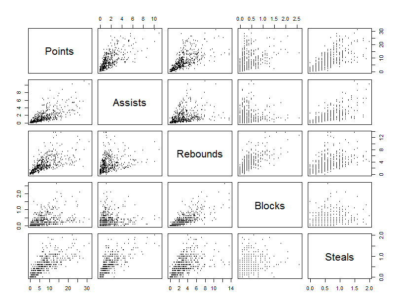

# Exploring NBA Player Statistics

## Introduction

The National Basketball Association (NBA) is a collection of 30 teams comprised of the worlds most skilled and athletic basketball players. The game of basketball relies on a balance between athleticism and skill because of the tradeoff between two and three point shots.  As seen in the figure below there is a painted arc on the floor of the court, where if the player’s feet are behind the arc when they jump or shoot without jumping the shot is worth three points instead of the normal two.  The final way to score is with shots worth one point where the player is free to shoot without interference from the line 15ft straight back from the basket, which are awarded from fouls.

The data set I used is of the cumulative player statistics for 517 players from the 2016-2017 NBA season.  The data set is available online [here](https://www.mysportsfeeds.com/data-feeds/nba/feedlist/).  The data set contains full stats for the 82 regular season games.

## Exploration
NBA player’s performance in any given game is usually measured by 5 main statistics, points scored, assists, rebounds, blocks, and steals.  Below is a pairwise comparison chart between the five stats.  Most of the scatterplots follow a tight pattern towards the origin and fan out as the observations get more extreme.  This could be due to a few factors.  One being the scale of the charts.  The exceptionally skilled players that are putting up the extreme numbers do so because they are a step above their peers, so while the league average may be closer to the origin, they are outliers in their specialization, dragging the scale outward.  Also while there are correlations between the stats, that may not prove causation, so there is an opportunity for increased variability there.

The stats all have positive relationships, but it is hard to tell how strong the relationship is from this chart.  So we need to see the strengths of the relationships.  Below is a chart that compares the linear correlations of the five main stats, with the bigger and darker blue circles showing a stronger correlation between the two variables.

As would be expected the diagonals all have correlations of 1 because they are the same stat.  Points scored seem to have strong correlations with almost all of the other stats except for blocks.  Blocks does not seem to have a strong correlation with any other stat, except for possibly rebounds, the smallest of which being assists.  Looking at the scatterplots above there does not seem to be non-linear relationships between blocks and any other stat either, with high amounts of variability in all of the pertinent plots.  Because of this, there might be another factor that could be influencing blocking ability.

One possible factor is player height.  Looking at the chart below the median blocks per game increases with height.  Variability also increases as height increases, which is similar to the variability trends in the pairwise scatterplots.

With the average height in the NBA being around 6’7” it is reasonable to assume that player height plays a significant role in the game.  Looking at the histogram above, we can see that the shape of the data is fairly left skewed.  The skewness could be due to a natural height limit inherent to the human population that NBA players have approached.

Continuing on this line of thought more than just blocks could be affected by height.  Because of value of height in basketball it would make sense that scoring ability would be related.  By comparing the boxplots of scoring percentage for each categorical height category we can examine trends.  The figure below shows the boxplots for height and overall scoring percentage, regardless of two or three point shots.  We can see an obvious positive trend in shooting percentage when compared with height.  The extreme outliers in the boxplot are due to players who only took a few shots so their percentages were either extremely high or extremely low.

Taking this idea even further, it might make sense that two-point shots would have even higher comparative percentages when player height is higher. Looking at the figure below, it would seem as if the opposite is true.  The overall mean percentage has gone up from 41.44 for all shots to 45.21 for two-point shots and back down to 26.17 for three-point-shot.  Somewhat counterintuitively, it seems that the taller players didn’t gain much in shooting percentage while the shorter players had much larger gains.  One possible theory for this strange result is the shot choice of the players at different height points.  The taller players are more likely to play closer to the basket and shoot a higher proportion of two-point shots to three-point shots, while the shorter players are likely more skilled and shooting a higher proportion of three-point shots which are much riskier than two-point shots.  

Looking at the three-point-shot boxplots the percentages seem to have a slight downward trend until around 6’10” where a large amount of variability is introduced. All of the boxplots have a high level of variability when it comes to the more extreme heights, below 6’0” and above 7’0”, because there are not many players in league outside of that height range to collect data on.

While height does seem to have a small effect on player performance it is not enough to determine that it is the main influencer on performance.  Another factor that could be heavily influencing players is skill level.  Common stats that are attributed to player skill level is three-point percentage and assists.  Comparing the two stats below, there does not seem to be any relationship between the two, so general skill level of a player cannot be the primary determinant either.

The old saying “practice makes perfect” holds true for many things in life, and NBA player performance is no exception.  Looking at the chart of games played and points scored fitted with a regression line there is a strong upward trend throughout, with a possible exponential relationship indicated by the kick up towards full season participation.  The relationship between minutes and points is even stronger, and obviously non-linear.

A possible catch-22 is that without playing more a player does not have the same opportunity to score more, but without scoring more a player has less likelihood to get playing time.  This introduces a confounding variable that could be the cause of the seemingly exponential pattern in the data.  While there are many factors that play into a player’s performance, one thing is for certain, the more you play the better you are.

## References
Sports Court Dimensions.com. "Basketball Court Dimensions & Measurements."SportsCourtDimensions.com. Sports Court Dimensions.com, 2015. Web. 12 June 2017.
